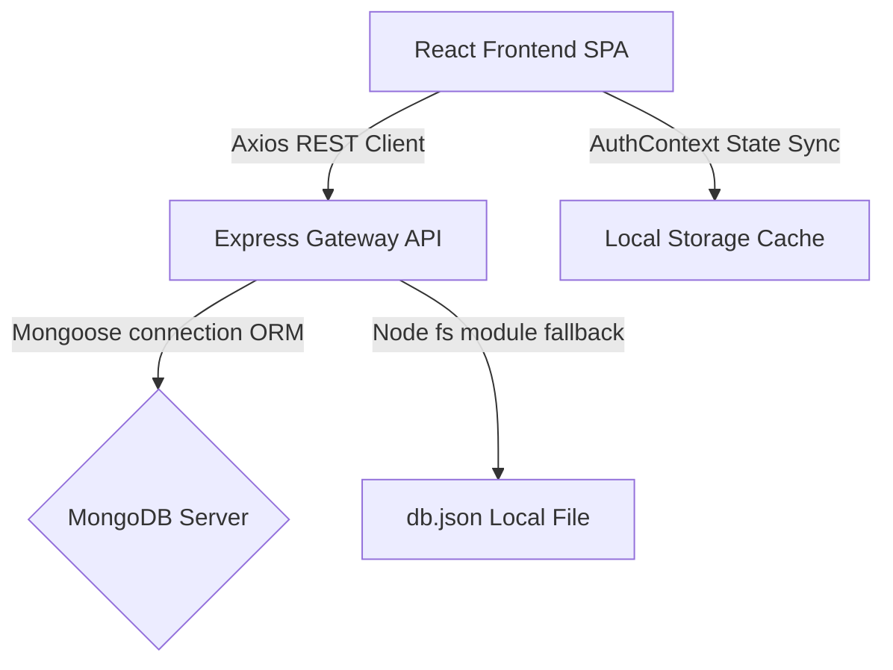

# AI Health Tracking System: End-to-End Technical Documentation

This documentation provides an in-depth breakdown of the **AI Health Tracking System (AI HealthTrack)**, a web application designed to log daily biometrics, run diagnostic evaluations, visualize progress over time, and output actionable health directives.

---

## 1. System Architecture & Flow

AI HealthTrack is built as a decoupled, full-stack single-page application (SPA):



### End-to-End Data Pipeline
1. **User Authentication**: The client submits email/password credentials. The server evaluates the credentials, signs a JSON Web Token (JWT) with user details, and returns the token. The frontend caches this token in `localStorage` and injects it into all future requests via Axios interceptors.
2. **Metrics Ingestion**: The user inputs current biometrics (weight, height, age, sleep, water, calories, exercise, resting heart rate).
3. **Diagnostics & Storage**: The Express endpoint `/health/record` validates inputs. The server checks database status (MongoDB vs Local JSON file), saves the record, computes diagnostics metrics (BMI, Daily Calorie Needs, Health Score, workout/diet/sleep suggestions), and sends the parsed results back to the client.
4. **Dashboard Sync**: The frontend receives the response, appends the new record to its state arrays, recalculates averages (weight, sleep, calories, active mins), updates the trends chart, and outputs dynamic modal-less notifications.

---

## 2. Directory Map

The codebase is organized into two primary folders: `backend` and `client`.

```text
ai_health_tracking/
│
├── backend/                             # Server-side Application
│   ├── .env                             # Port, MongoDB URI, and JWT Secret configuration
│   ├── database.js                      # Database models and fallback persistence engine
│   ├── db.json                          # JSON database file used in offline/fallback mode
│   ├── server.js                        # Express router, authentication, and diagnostics calculations
│   └── package.json                     # Server runtime dependencies
│
└── client/                              # Client-side Application (Vite + React)
    ├── .env                             # Frontend API URL configuration
    ├── index.html                       # HTML5 entry structure
    ├── postcss.config.js                # CSS processor configuration
    ├── tailwind.config.js               # Tailwind CSS custom themes and spacings
    ├── vite.config.js                   # React/Vite development server configurations
    ├── package.json                     # Client-side bundler and dependencies
    └── src/
        ├── main.jsx                     # DOM rendering entrypoint
        ├── App.jsx                      # App route definitions (public vs protected layouts)
        ├── App.css                      # Global overrides
        ├── index.css                    # Core styling, Outfit/Inter typography, color tokens, animations
        │
        ├── assets/                      # Static assets and image files
        │
        ├── components/                  # Modular React Elements
        │   ├── Charts.jsx               # Recharts-based multi-metric area graphs
        │   ├── Footer.jsx               # Footer element
        │   ├── HealthInputForm.jsx      # Demographic/vitals input form
        │   ├── Loader.jsx               # AI simulation overlay spinner
        │   ├── MetricsCards.jsx         # Vital cards displaying BMI, calorie needs, and health score
        │   ├── Modal.jsx                # Reusable overlay dialogue modal
        │   ├── Navbar.jsx               # Header logo and profile user trigger
        │   ├── NotificationCard.jsx     # AI warning flags and critical advice list
        │   ├── ProfileCard.jsx          # Profile details and daily goal target configuration
        │   ├── ProtectedRoute.jsx       # Route shield checking for session tokens
        │   ├── Recommendations.jsx      # Daily suggestion checklist component
        │   ├── ReportCard.jsx           # Statistical averages and progress bars
        │   └── Sidebar.jsx              # Collapsible dashboard layout sidebar
        │
        ├── context/
        │   └── AuthContext.jsx          # Context provider managing session, data syncing, and alerts
        │
        ├── layouts/
        │   ├── DashboardLayout.jsx      # Layout with Navbar, Sidebar, and content viewport
        │   └── RootLayout.jsx           # Root layout wrapper for landing page
        │
        ├── pages/                       # Pages mounted on router endpoints
        │   ├── Dashboard.jsx            # Main dashboard showing metrics cards, charts, and forms
        │   ├── Home.jsx                 # Landing page
        │   ├── Login.jsx                # Login page
        │   ├── Signup.jsx               # Signup page
        │   ├── Reports.jsx              # Statistical analysis and delete log controller
        │   ├── Recommendations.jsx      # Interactive AI wellness checklist
        │   ├── Profile.jsx              # User information page
        │   ├── Settings.jsx             # Notification toggle and database clear zone
        │   └── NotFound.jsx             # 404 page
        │
        └── services/
            └── api.js                   # Axios wrapper with mock cancellation triggers
```

---

## 3. Database Architecture & Resilience Fallback

The database system is designed to run anywhere, without requiring a pre-installed MongoDB database engine. The persistence layer in [database.js](file:///c:/ai_health_tracking/backend/database.js) handles this automatically:

```text
               +---------------------------+
               |  database.js Initialized  |
               +-------------+-------------+
                             |
                  Try MongoDB Connection
                             |
             +---------------+---------------+
             | (Succeeds)                    | (Fails / Timeout)
             v                               v
    +-----------------+             +------------------+
    |  Mongoose ODM   |             | Custom Mock ODM  |
    | (MongoDB Atlas/ |             |  (db.json File   |
    |    Local Host)  |             |     Fallback)    |
    +-----------------+             +------------------+
```

### Models & Schema Specifications

#### User Model
| Field | Type | Default | Description |
| :--- | :--- | :--- | :--- |
| `_id` | ObjectId / String | Auto-generated | Unique identifier |
| `name` | String | *Required* | User's full name |
| `email` | String | *Required, Unique* | Email address |
| `password` | String | *Required* | Hashed password |
| `age` | Number | `26` | Age in years |
| `height` | Number | `178` | Height in cm |
| `weight` | Number | `71.2` | Weight in kg |
| `gender` | String | `'Male'` | Gender category |
| `targetCalories` | Number | `2300` | Target daily calorie budget |
| `targetWater` | Number | `3.0` | Target daily water budget (Liters) |
| `targetSleep` | Number | `8` | Target daily sleep budget (Hours) |

#### Health Record Model
| Field | Type | Default | Description |
| :--- | :--- | :--- | :--- |
| `_id` | ObjectId / String | Auto-generated | Unique identifier |
| `user_id` | ObjectId / String | *Required* | Association to user |
| `weight` | Number | *Required* | Logged weight (kg) |
| `height` | Number | *Required* | Logged height (cm) |
| `age` | Number | *Required* | Logged age (years) |
| `sleep_hours` | Number | *Required* | Sleep hours logged |
| `calories_consumed` | Number | *Required* | Calorie intake logged (kcal) |
| `exercise_minutes` | Number | *Required* | Active physical minutes logged |
| `heart_rate` | Number | *Required* | Resting heart rate (bpm) |
| `water_intake` | Number | `2.0` | Liquid hydration logged (L) |
| `gender` | String | `'Male'` | Logged gender value |
| `created_at` | Date | `Date.now` | Registration timestamp |

---

## 4. Backend API Endpoints Reference

All endpoints (excluding signup and login) require a JSON Web Token (JWT) sent in the HTTP Request Header:
`Authorization: Bearer <JWT_TOKEN_STRING>`

### 4.1 Authentication Router

#### Sign Up User
* **Endpoint**: `POST /auth/signup`
* **Request Payload**:
  ```json
  {
    "name": "Alex Mercer",
    "email": "alex@example.com",
    "password": "securepassword123"
  }
  ```
* **Success Response (201 Created)**:
  ```json
  {
    "message": "User created successfully",
    "token": "eyJhbGciOi...",
    "access_token": "eyJhbGciOi...",
    "user": {
      "_id": "647f12...",
      "name": "Alex Mercer",
      "email": "alex@example.com",
      "age": 26,
      "height": 178,
      "weight": 71.2,
      "gender": "Male",
      "targetCalories": 2300,
      "targetWater": 3.0,
      "targetSleep": 8
    }
  }
  ```

#### Log In User
* **Endpoint**: `POST /auth/login`
* **Request Payload**:
  ```json
  {
    "email": "alex@example.com",
    "password": "securepassword123"
  }
  ```
* **Success Response (200 OK)**:
  ```json
  {
    "token": "eyJhbGciOi...",
    "access_token": "eyJhbGciOi...",
    "user": {
      "_id": "647f12...",
      "name": "Alex Mercer",
      "email": "alex@example.com",
      "age": 26,
      "height": 178,
      "weight": 71.2,
      "gender": "Male",
      "targetCalories": 2300,
      "targetWater": 3.0,
      "targetSleep": 8
    }
  }
  ```

#### Fetch Current User Profile
* **Endpoint**: `GET /auth/me`
* **Success Response (200 OK)**:
  ```json
  {
    "user": {
      "_id": "647f12...",
      "name": "Alex Mercer",
      "email": "alex@example.com",
      "age": 26,
      "height": 178,
      "weight": 71.2,
      "gender": "Male",
      "targetCalories": 2300,
      "targetWater": 3.0,
      "targetSleep": 8
    }
  }
  ```

#### Update Profile Configuration
* **Endpoint**: `PUT /auth/profile`
* **Request Payload**:
  ```json
  {
    "name": "Alex Mercer",
    "email": "alex_new@example.com",
    "age": 27,
    "height": 179,
    "weight": 72.5,
    "gender": "Male",
    "targetCalories": 2400,
    "targetWater": 3.5,
    "targetSleep": 7.5
  }
  ```
* **Success Response (200 OK)**:
  ```json
  {
    "message": "Profile updated successfully",
    "token": "eyJhbGciOi...",
    "access_token": "eyJhbGciOi...",
    "user": {
      "_id": "647f12...",
      "name": "Alex Mercer",
      "email": "alex_new@example.com",
      "age": 27,
      "height": 179,
      "weight": 72.5,
      "gender": "Male",
      "targetCalories": 2400,
      "targetWater": 3.5,
      "targetSleep": 7.5
    }
  }
  ```

---

### 4.2 Health Records Router

#### Add Daily Vitals Record
* **Endpoint**: `POST /health/record` (or `POST /health/add`)
* **Request Payload**:
  ```json
  {
    "weight": 72.1,
    "height": 178,
    "age": 26,
    "sleep_hours": 7.5,
    "calories_consumed": 2150,
    "exercise_minutes": 45,
    "heart_rate": 68,
    "water_intake": 2.8,
    "gender": "Male"
  }
  ```
* **Success Response (201 Created)**:
  ```json
  {
    "success": true,
    "message": "Health record added successfully",
    "data": {
      "_id": "rec_091a...",
      "user_id": "647f12...",
      "weight": 72.1,
      "height": 178,
      "age": 26,
      "sleep_hours": 7.5,
      "calories_consumed": 2150,
      "exercise_minutes": 45,
      "heart_rate": 68,
      "water_intake": 2.8,
      "gender": "Male",
      "health_score": 95,
      "recommendations": [
        "Excellent sleep duration! Keep maintaining this routine.",
        "Maintain a balanced diet with plenty of fiber and lean proteins."
      ]
    },
    "bmi": 22.76,
    "bmi_category": "Normal weight",
    "calorie_needs": 2355,
    "health_risk_score": 95,
    "recommendation_workout": "Excellent workout routine! Maintain consistency.",
    "recommendation_diet": "Maintain a balanced diet with plenty of fiber and lean proteins.",
    "recommendation_sleep": "Excellent sleep duration! Keep maintaining this routine."
  }
  ```

#### Fetch Historical Records
* **Endpoint**: `GET /health/history`
* **Success Response (200 OK)**:
  ```json
  [
    {
      "_id": "rec_091a...",
      "user_id": "647f12...",
      "weight": 72.1,
      "height": 178,
      "age": 26,
      "sleep_hours": 7.5,
      "calories_consumed": 2150,
      "exercise_minutes": 45,
      "heart_rate": 68,
      "water_intake": 2.8,
      "gender": "Male",
      "created_at": "2026-05-22T08:00:00.000Z",
      "date": "2026-05-22T08:00:00.000Z",
      "bmi": 22.76,
      "bmi_category": "Normal weight",
      "calorie_needs": 2355,
      "health_risk_score": 95,
      "recommendation_workout": "Excellent workout routine! Maintain consistency.",
      "recommendation_diet": "Maintain a balanced diet with plenty of fiber and lean proteins.",
      "recommendation_sleep": "Excellent sleep duration! Keep maintaining this routine."
    }
  ]
  ```

#### Delete Specific Health Log
* **Endpoint**: `DELETE /health/record/:id`
* **Success Response (200 OK)**:
  ```json
  {
    "success": true,
    "message": "Health record deleted successfully"
  }
  ```

---

## 5. AI Diagnostics & Medical Calculations Engine

The diagnostics engine in [server.js](file:///c:/ai_health_tracking/backend/server.js#L253-L319) dynamically calculates biometric outputs from logged variables:

### 5.1 Body Mass Index (BMI)
$$BMI = \frac{\text{weight } (kg)}{\left(\frac{\text{height } (cm)}{100}\right)^2}$$

#### Clinical Categories:
* **Underweight**: $BMI < 18.5$
* **Normal weight**: $18.5 \le BMI < 25.0$
* **Overweight**: $25.0 \le BMI < 30.0$
* **Obese**: $BMI \ge 30.0$

---

### 5.2 Calorie Needs Estimation
The system calculates Basal Metabolic Rate (BMR) using the Mifflin-St Jeor formula, then adds physical activity expenditure:

$$\text{BMR (Male)} = (10 \times \text{weight in kg}) + (6.25 \times \text{height in cm}) - (5 \times \text{age in years}) + 5$$
$$\text{BMR (Female)} = (10 \times \text{weight in kg}) + (6.25 \times \text{height in cm}) - (5 \times \text{age in years}) - 161$$

$$\text{Daily Calorie Needs} = \text{BMR} \times 1.2 + (\text{exercise minutes} \times 5)$$

---

### 5.3 Health Score Index
The Health Score rates user health on a scale from 10 to 100. It starts at a base score of `100` and subtracts points for biometric deviations:

| Condition | Point Deduction |
| :--- | :---: |
| **Abnormal BMI**: Underweight ($<18.5$) or Overweight ($25$ to $30$) | **-10** |
| **Obese BMI**: Obesity ($ge 30$) | **-20** (accumulates with BMI abnormality check) |
| **Sleep Deviance**: Sleep duration $<7$ hours or $>9$ hours | **-15** |
| **Anomalous Heart Rate**: resting HR $<60$ bpm or $>100$ bpm | **-15** |
| **Sedentary Log**: exercise minutes $<30$ min | **-10** |
| **Insufficient Hydration**: water intake $<2.0$ Liters | **-10** |

$$\text{Health Score} = \text{Clamp}(10, 100, 100 - \sum \text{Deductions})$$

---

### 5.4 Advice Directives Logic

#### Workout Recommendation:
* **Exercise $< 30$ mins**: *"Try to aim for at least 30 minutes of moderate exercise daily."*
* **Exercise $> 90$ mins**: *"Great exercise levels, but ensure you include recovery days."*
* **Normal range**: *"Excellent workout routine! Maintain consistency."*

#### Nutrition Recommendation:
* **Obese/Overweight BMI**: *"Focus on a small calorie-deficit diet rich in whole foods, protein, and vegetables."*
* **Underweight BMI**: *"Increase intake of nutrient-dense whole foods and healthy fats."*
* **Normal weight**: *"Maintain a balanced diet with plenty of fiber and lean proteins."*

#### Sleep Recommendation:
* **Sleep $< 7$ hours**: *"Aim for 7-8 hours of quality sleep to support recovery and cognitive function."*
* **Sleep $> 9$ hours**: *"Try to avoid oversleeping; keep sleep duration between 7-9 hours."*
* **Normal range**: *"Excellent sleep duration! Keep maintaining this routine."*

---

## 6. Frontend State & Authentication Flow

Global states are managed by `AuthProvider` in [AuthContext.jsx](file:///c:/ai_health_tracking/client/src/context/AuthContext.jsx):

* **Global States**:
  * `token`: Active session string (backed by `localStorage` synchronization).
  * `user`: Logged-in user's profile metadata and daily targets.
  * `history`: List of all logged health records.
  * `currentPrediction`: The latest health record, containing computed metrics.
  * `notifications`: Dynamically calculated health warnings.

* **Alert & Warning Calculations**:
  On every load of `currentPrediction`, the context automatically parses parameters and generates custom user notifications:
  * *BMI >= 25*: Warning -> consider balanced diet.
  * *BMI >= 30*: Critical -> consult professional.
  * *Sleep < 6.5h*: Critical Sleep Deficit -> cortisol warnings.
  * *Exercise < 30m*: Warning -> sedentary alert.
  * *Water < 2.0L*: Warning -> dehydration alert.
  * *Heart Rate > 100 bpm*: Critical -> elevated heart rate alert.

---

## 7. Client-side Mock Mode Switch

In [api.js](file:///c:/ai_health_tracking/client/src/services/api.js#L7), setting `USE_MOCK_API = true` enables local sandbox mode:

1. **Request Interceptor Hook**: Intercepts outgoing requests to mock endpoints (`/auth/login`, `/health/history`, etc.).
2. **Mock Calculations**: Runs calculations (BMR, BMI, Health Score) directly in the browser's JavaScript environment.
3. **Axios Interceptor**: Throws a cancelled promise containing the mock JSON response data:
   ```javascript
   throw new axios.Cancel(JSON.stringify({ status: 200, data: responseData }));
   ```
4. **Response Interceptor Hook**: Catches the cancel exception, unpacks the mock response, and returns it as a successful promise resolve:
   ```javascript
   return Promise.resolve({ status: parsed.status, data: parsed.data });
   ```

This mock configuration allows testing frontend interactions without launching the Node.js backend or connecting to a database.

---

## 8. UI/UX Design System

The styling guide [index.css](file:///c:/ai_health_tracking/client/src/index.css) defines the visual system:

### 8.1 Design Tokens
* **Typography**: Primary display font is **Outfit** (modern, curved sans-serif) for titles, headings, and metrics labels. Body font is **Inter** (clean, high-readability) for summaries and tables.
* **Color Palette**:
  * *Primary Color*: Blue (`#2563eb`)
  * *Accent Color*: Emerald (`#059669`)
  * *Background Color*: Light gray (`#f8fafc`) with subtle radial blue/green gradient blobs.
  * *Text Main*: Dark slate (`#0f172a`)
  * *Text Muted*: Slate gray (`#64748b`)
* **Components**: Card designs use subtle borders (`#e2e8f0`) instead of heavy glassmorphism for a cleaner look. A translate animation is applied to interactive elements on hover:
  ```css
  .glass-hover:hover {
    border-color: rgba(37, 99, 235, 0.15);
    transform: translateY(-2px);
  }
  ```

---

## 9. Setup & Development Guide

### Environment Configuration

#### Backend `.env` (`backend/.env`)
```env
PORT=8000
MONGO_URI=mongodb://localhost:27017/health_tracking_ai
JWT_SECRET=your-secure-jwt-secret-string-here
JWT_EXPIRATION_HOURS=24
```

#### Frontend `.env` (`client/.env`)
```env
VITE_API_URL=http://localhost:8000
```

### Installation Steps

1. **Clone the repository and enter the workspace**:
   ```bash
   cd c:/ai_health_tracking
   ```
2. **Install and run the Backend**:
   ```bash
   cd backend
   npm install
   npm start
   ```
3. **Install and run the Frontend**:
   ```bash
   cd ../client
   npm install
   npm run dev
   ```
